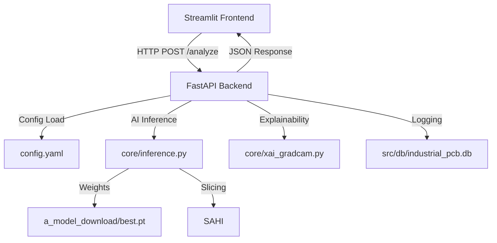

# InspectAid: Industrial PCB Defect Detection System 🔬

[](https://www.python.org/)
[](https://fastapi.tiangolo.com/)
[](https://streamlit.io/)
[](https://github.com/ultralytics/ultralytics)

**InspectAid** is a professional-grade Automated Optical Inspection (AOI) system designed for manufacturing quality assurance. It leverages a hybrid approach combining **YOLOv8** for high-speed object detection and **SAM 2** (Segment Anything Model 2) for sub-pixel accurate defect segmentation.

---

## 👨‍💻 Author
**TASNEEM-CHA123**

---

## 🏗️ System Architecture

InspectAid uses a decoupled **Client-Server Architecture** to ensure high-performance inference and a responsive user experience.



---

## 🚀 Key Features

- **Decoupled Backend:** Powered by **FastAPI** to handle heavy neural computations without freezing the UI.
- **Explainable AI (XAI):** Integrated **GradCAM** heatmaps to show the operator "why" a defect was flagged.
- **Industrial Slicing (SAHI):** Supports high-resolution PCB scans by using Slicing Aided Hyper Inference.
- **Traceability:** Automatic logging of `Operator ID`, `Serial Number`, and `Defect Severity` in an asynchronous SQLite database.
- **Instant Reporting:** Generates professional QA Audit PDF reports directly from the dashboard.

---

## 🛠️ Installation & Setup

### 1. Prerequisite: Virtual Environment
We recommend using the provided setup script to isolate your environment.

```bash
# Using the automated setup script
.\setup_venv.bat

# OR manually
python -m venv venv
source venv/Scripts/activate  # (bash) OR .\venv\Scripts\activate (powershell)
pip install -r requirements.txt
```

---

## ⚙️ Running the Project

You need to run the **Backend** and **Frontend** in two separate terminals.

### 1. Start the API Server (Backend)
```bash
uvicorn src.api.main:app --reload --host 0.0.0.0
```
*Access the interactive API docs at: http://localhost:8000/docs*

### 2. Start the Dashboard (Frontend)
```bash
streamlit run src/ui/app.py
```

---

## 📂 Project Structure

```text
major_2_v2/
├── a_model_download/   # AI Model weights (.pt)
├── config/             # System configuration
├── sample_images/      # Benchmark PCB scans
├── src/
│   ├── api/            # FastAPI Server logic
│   ├── core/           # YOLO, SAM 2, and GradCAM logic
│   ├── db/             # SQLite CRUD handlers
│   └── ui/             # Streamlit Dashboard components
└── requirements.txt    # Project dependencies
```

---

## 📜 Roadmap & Future Work
- [x] Phase 1: MVP Prototype (YOLO + SAM)
- [x] Phase 2: Production-Ready Refactoring (FastAPI + DB + XAI)
- [ ] Phase 3: Deployment (Dockerization & Edge Integration)

---
*Developed for Industrial Quality Assurance Standards.*
